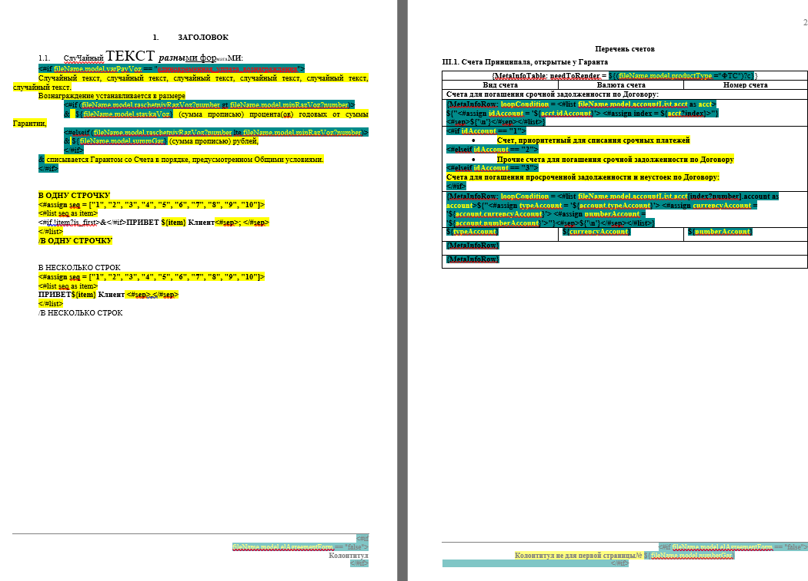
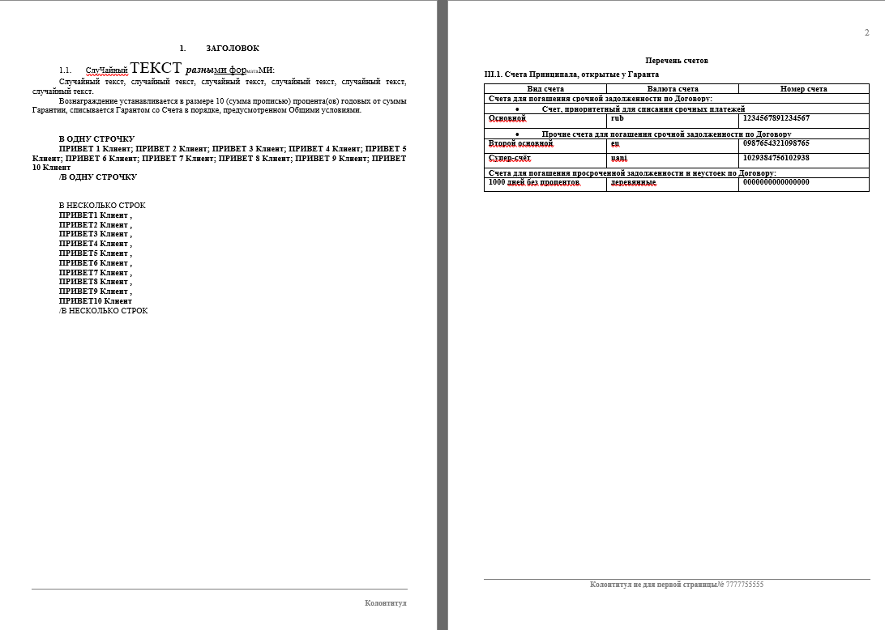

# wordInterpritator
Данный проект объединяет в себе возможности Apache POI и Freemarker для генерации Word файлов(docx).
В данный момент на стадии MVP(документации как таковой тоже нет), для демонстрации можно просто запустить [psvm](src/main/java/com/sbrf/idrisov/interpritator/Main.java) и результат посмотреть в [result.docx](src/main/resources/result.docx)(после запуска)

## Примеры
### Вход:
[Модель](src/main/resources/forExample.xml)
и сам шаблон

### Выход:
